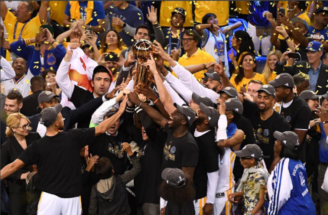
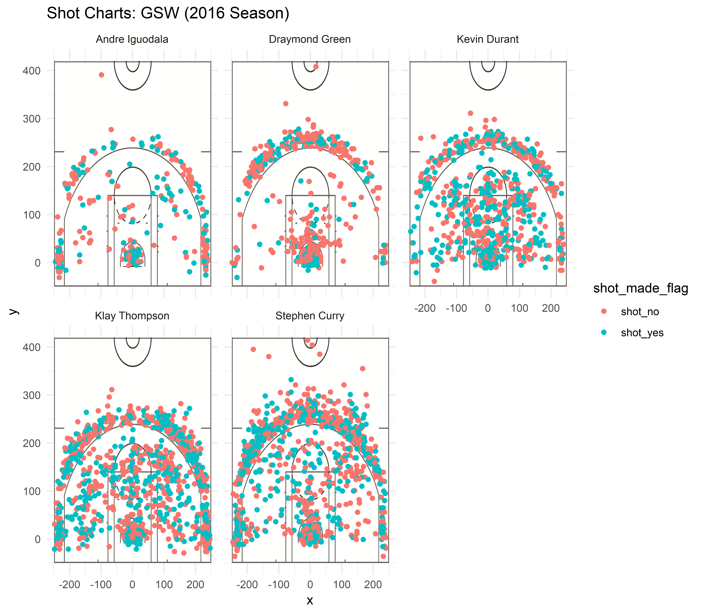

workout01-patrick-hong
================
Patrick Hong
March 11, 2019

### Golden State Warriors 2016-2017 Season Full Recap



Undoubtedly, the Warriors are one of the most successful teams in NBA history. After 4 decades of dormancy, the Warriors emerged as a powerhouse in 2015 and has attended every NBA final since then. With the emergence of stars Stephen Curry, Klay Thompson, and Draymond Green the Warriors finally found success and it wasn't long until records started being broken. During the Warriors' 2015-2016 regular season, they broke the all time best regular season record going 73-9, the first time a team had less than 10 losses a season. The Warriors also did not drop a single game in their first 24 wins. However, the Warriors would end up falling to the Cleveland Cavaliers in the 2016 NBA finals losing 4-3. 2016-2017 was also a great year for the Warriors in which their playoff run would go down in history as the first team in all four major league sports to start 15-0. Their ending record of 16-1 was equally as impressive. They ended the regular season 67-15 which was their 2nd highest in franchise history and topped the standings in the west. In addition to the already star-studded roster, the Warriors acquired Kevin Durant from the Oklahoma City Thunder which further contributed to the Warriors bolstering a starting lineup full of super stars. However, to truly appreciate the achievements of the Warriors is to look at the numbers.

#### **Records set during 2016-2017**

**Individual**

-   Stephen Curry scores 13 three-pointers in a single game breaking the previous record of 12.
-   Kevin Durant scored 20 or more points 72 games in a row.
-   Stephen Curry makes a 3 in 196 consecutive games (counting regular-season and post-season games).
-   Klay Thompson became the first player to score 60 points in under 30 minutes (He scored 60 in 29 minutes),
-   Draymond Green became the first player to score a triple double while scoring under 10 points (He had 12 rebounds, 10 assists, and 10 steals).

**Team**

-   Warriors finished the post-season 16-1 which was the best record in NBA History.
-   Warriors started the post-season 15-0 which was the best start in NBA History.
-   The Warriors avoided back to back losses 146 games in a row.
-   The Warriors had the fewest turnovers in an NBA Finals game with 4 (tied with two other teams).
-   The Warriors had 4 players selected for the all star game (tied with three other teams).

#### **Shooting Percentages**

##### **2 Point Field Goal Effective Shooting Percentages**

One of the greatest strengths of the Warriors is their ability to shoot. With shooting being the most important statistic in basketball, the Warriors' effective shooting percentage leads the league and is a big reason why they are so successful. Below is a table showing the effective 2 point shooting percentages for the Warriors' best players: Curry, Green, Durant, Thompson, and Iguodala.

<center>
<h6>
2 Point Effective Shooting Percentage by Player
</h6>
</center>
``` r
arrange(two_pt, desc(perc_made))
```

    ##       name total made perc_made
    ## 1 Iguodala   210  134 0.6380952
    ## 2   Durant   643  390 0.6065319
    ## 3    Curry   563  304 0.5399645
    ## 4 Thompson   640  329 0.5140625
    ## 5    Green   346  171 0.4942197

Interestingly, Iguodala has the highest percentage of 2 point field goals made at 63.9%; however, it should be noted that Iguodala shoots significantly less than the other players. Durant, Curry, and Thompson are the primary driving force behind the Warriors' offense. Kevin Durant is the Warriors' best 2 point field goal shooter: he takes the most shots at 643 but still makes 390 of them resulting in a very respectable 61% 2 point field goals made. It is also important to highlight that the average 2 point field goal percentage in the NBA is a mere 45.7%. With all the Warriors players passing that mark shows just how good they are at shooting within the arc.

##### **3 Point Field Goal Effective Shooting Percentages**

Although the Warriors are great 2 point shooters, their ability to shoot 3 pointers is what really sets them apart from the competition. Players like Curry and Thompson continuously defy all odds and land clutch 3 pointers in the most important of situations. The table below shows the effective 2 poinnt shooting percentages for Curry, Green, Durant, Thompson, and Iguodala.

<center>
<h6>
3 Point Effective Shooting Percentage by Player
</h6>
</center>
          name total made perc_made
    1 Thompson   580  246 0.4241379
    2    Curry   687  280 0.4075691
    3   Durant   272  105 0.3860294
    4 Iguodala   161   58 0.3602484
    5    Green   232   74 0.3189655

Surprisingly Curry does not have the highest percentage of 3's made. Thompson who is often overshadowed by Curry, makes more than 42% of the 3's he takes. Curry isn't far behind: shooting a respectable 41% from beyond the arc. Curry does however, take more than 100 more 3's than Thompson. Durant and Iguodala are also great 3 point shooters: shooting 38.6% and 36.0% respectively. The league's average is 35.7% from behind the 3 point line so 4 out of the 5 Warrior players are shooting above average. The only player to struggle is Draymond Green but it is well known that Green is not a good 3 point shooter.

##### **Overall Field Goal Effective Shooting Percentages**

Durant is a great 2 point shooter while Thompson and Curry are great 3 point shooters. How do they compare overall? Below is a table showing the overall shots taken, made, and percentage made by Curry, Green, Durant, Thompson, and Iguodala.

<center>
<h6>
Overall Effective Shooting Percentage by Player
</h6>
</center>
          name total made perc_made
    1   Durant   915  495 0.5409836
    2 Iguodala   371  192 0.5175202
    3 Thompson  1220  575 0.4713115
    4    Curry  1250  584 0.4672000
    5    Green   578  245 0.4238754

Looking at the raw statistics, Durant appears to be the Warriors' best shooter. However, it is dangerous to make assumptions based on raw data without analysis. From the statistics above it would appear that Curry is not a good shooter with only 46.7% of his shots going into the basket. The overall shot percentages made disguises the proportion of shots each player takes between 2 pointers and 3 pointers. The likelihood of scoring a 2 is much higher than scoring a 3. Curry and Thompson take so many 3 point shots that it skews their data and makes their overall shot made percentage lower. Durant is known to be a well rounded player who specializes from inside the 3 point line but is also a decent 3 point shooter. Because he takes so many 2 point shots, his overall percentage made is also skewed and makes his percentage made appear much better than the others. Andre Iguodala also boasts a high percentage made but having taken only 371 shots total, it is not as representative of his true ability to shoot. As a result, each Warriors player has their own strengths. Undoubtedly, Curry, Durant, and Thompson are 3 of the best shooters in the league but each specialize in a different kind of shot. Iguodala is also a good shooter given the opportunity but he is not prioritized and only given the ball under certain circumstances. Comparatively Green is not as good of a shooter but his ability to run the defense certainly adds to his personal value towards the team.

#### **Shots Taken**

Next it is important to analyze the types of shots each player is taking. By studying the type of shots each player takes, it is possible to assess the strengths of a player and how he wants to play the offense. Below is a figure displaying all the shots taken by Iguodala, Green, Durant, Thompson, and Curry during the 2016-2017 season. The green dots show a made shot while red dots show misses.



3 things pop out instantly: Iguodala and Green take considerably less shots than the other 3, Curry is much more likely to take long 3 pointers and Draymond Green likes to play inside the paint. Analyzing each player individually, Iguodala appears to be an all-around shooter. He is solid inside the paint and behind the 3 point line but prefers to not take many long 2 point shots. Compared to the rest of the players, Draymond Green seems to struggle offensively whether shooting from inside the paint or behind the arc. His inside shots may be heavily contested by the opposing defense which may lead to a lot more misses. Kevin Durant does well up close and from afar. He is a good 3 point shooter but really excels at finishing inside the paint. Klay Thompson is the most all-around shooter out of everyone. He appears to shoot well no matter where he is on the court whether it is from behind the arc or driving in for a layup. Finally, Stephen Curry likes taking his shots either from up close or very far behind the arc. Curry is often known for making very deep 3 pointers that are sometimes near the half court line!

#### **Conclusion**

Without a doubt the Warriors are a super team. They have attended the NBA Finals the past 4 seasons and won 3 out of the 4. They consistently break long standing NBA records and continue their success by constantly acquiring the top talents in the league. The players work in harmony with Curry and Thompson firing from behind the arc while also being able to penetrate the opposing defense. Green's ability to defend the opposing team is also an asset to the Warriors' success. Overall, its the Warriors' ability to shoot better than every other team in the league that ultimately contribute to their success and the establishment of a Warrior led dynasty.
